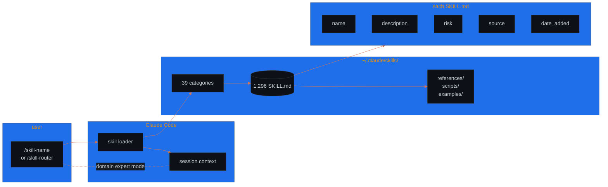

<!-- ──────────────────────────────────────────────────────────────────────── -->
<!--  My Claude Code Skills · 1,296 plug-and-play expertise modules         -->
<!--  Drop in ~/.claude/skills · invoke via /skill-name                     -->
<!-- ──────────────────────────────────────────────────────────────────────── -->

<p align="center">
  
</p>

<p align="center">
  
  
  
  
  
  
  
</p>

<p align="center">
  <b>The default Claude Code session knows everything in general and nothing in particular.</b><br/>
  Ask it to harden a Postgres schema, audit a Solidity contract, build a Stripe webhook, or design a K8s topology, and you're prompting from scratch each time. This repo is a 1,296-deep curated index of domain experts — every <code>/skill-name</code> swaps a generalist session into a specialist one with a battle-tested checklist already loaded.
</p>

<p align="center">
  <a href="#-quickstart">install →</a> ·
  <a href="#-categories">39 categories</a> ·
  <a href="#-skill-anatomy">skill format</a> ·
  <a href="docs/architecture.svg">architecture</a>
</p>

---

```text
$ claude --tail "audit the staging cluster's network policies"
[10:14:02] router      no skill loaded · session=generalist
[10:14:02] /skill-router "k8s network policy audit security"
[10:14:03] discover    candidates=[k8s-security-policies, security-audit, kubernetes-architect]
[10:14:03] match       k8s-security-policies score=0.94  category=cloud-devops/
[10:14:03] load        cloud-devops/k8s-security-policies/SKILL.md
[10:14:03] frontmatter risk=safe  source=community  date_added=2026-02-27
[10:14:03] activate    role=K8s NetworkPolicy auditor  refs=NIST 800-190 · CIS 5.x
[10:14:03] checklist   ingress default-deny? egress default-deny? ns-isolation?
[10:14:04] session     specialist mode active · prompt budget −470 tokens
[10:15:11] /skill-router "wait actually — also check pod security standards"
[10:15:11] suggest     k8s-manifest-generator + security-scanning-security-hardening
[10:15:11] stack       2 skills active concurrently · context preserved
[10:18:33] output      cluster audit · 14 findings · 3 critical · runbook attached
[10:18:33] done        skills used: 3  ·  invocations: 1 router + 2 named
```

---

## architecture



<!-- mobile fallback (GitHub mobile app does not render mermaid) -->
<p align="center"></p>

> **Skills are filesystem.** Each `<category>/<skill-name>/SKILL.md` is a YAML-fronted markdown file Claude Code reads and uses to specialize the session. No registry, no plugin manager, no API — drop the directory at `~/.claude/skills/` and `git pull` updates everything.

---

## 📊 by the numbers

| | |
|---|---|
| **Total skills** | 1,296 (`find . -name SKILL.md \| wc -l`) |
| **Categories** | 39 |
| **Largest category** | `azure/` — 120 SKILL.md (per-SDK + per-language coverage) |
| **AI/ML** | 100 (agents · RAG · prompt engineering · voice · evals) |
| **Integrations / SaaS** | 99 (50+ third-party providers — Slack, Stripe, Salesforce, Notion, …) |
| **Dev tooling** | 95 (debugging, refactoring, code review, git workflows) |
| **Security** | 83 (pentest, SAST, threat modeling, OWASP top-10, cloud audit) |
| **Cloud / DevOps** | 69 (K8s, Terraform, observability, multi-cloud, GitOps) |
| **Frontend / Backend** | 54 / 65 |
| **Frontmatter format** | `name` · `description` · `risk` · `source` · `date_added` (YAML) |
| **Skill spawn rate** | 1,282 → 1,296 between commits `a2f4210` and `358f478` |

<sub><!-- TODO: measure --> Per-skill activation latency, average tokens-per-skill, and skill-router top-K accuracy aren't measured — add once a benchmark harness lands. The `risk` field is also `unknown` on most skills; backfilling that taxonomy is on the roadmap.</sub>

---

## 🚀 quickstart

```bash
# clone into Claude Code's skills directory
git clone https://github.com/lloredia/My-claudeCode-skills-.git ~/.claude/skills

# verify
ls ~/.claude/skills | head            # 39 category folders
find ~/.claude/skills -name SKILL.md | wc -l   # 1,296
```

then in any Claude Code session:

```text
/skill-router        # describe what you need; get routed to the best match
/<skill-name>        # invoke a specific skill directly
```

keep in sync:

```bash
cd ~/.claude/skills && git pull
```

---

## 🗂 categories

The 39 categories cluster into **8 super-groups** by purpose. Skill counts on the right; folder name in `code`.

### 🛠 code foundation — 227 skills
*The day-to-day surface: write code in any language, build APIs, ship UIs, model data.*

| Category | # | What's in it |
|---|---:|---|
| `backend/` | 65 | Server frameworks — FastAPI, NestJS, Hono, Convex, Trigger.dev, Cloudflare Workers, gRPC Go, Rails, Spring Boot, microservices patterns |
| `frontend/` | 54 | React (Next.js, state, patterns), Tailwind, shadcn, Astro, SvelteKit, Angular, Vue, animations, accessibility |
| `languages/` | 41 | Per-language experts — TypeScript, Python, Go, Rust, C++, Bash, Ruby, Elixir, Scala, Kotlin, PHP, C#, Haskell, Julia |
| `database/` | 27 | PostgreSQL, vector DBs, query optimization, migrations, ORMs (Prisma, Drizzle), Neon, ClickHouse, embedding strategies |
| `architecture-patterns/` | 25 | DDD, CQRS, event sourcing, sagas, C4 modeling, Clean Code, ADRs, workflow orchestration |
| `functional-programming/` | 15 | fp-ts, pipe, Either, TaskEither, async patterns, FP refactor, FP React, error modeling |

### 🧪 workflow & quality — 181 skills
*The discipline layer — test, debug, review, document, remember.*

| Category | # | What's in it |
|---|---:|---|
| `dev-tools/` | 95 | Debugging, refactoring, code review, git workflows, plan-writing, dependency upgrade, codebase audit, error tracing |
| `testing-qa/` | 34 | TDD orchestration, e2e patterns, Playwright, code review checklists, performance testing, test fixing |
| `docs-writing/` | 34 | Wiki architecture, brand guidelines, scientific writing, mermaid, beautiful prose, doc generators, changelog automation |
| `context-memory/` | 18 | Context restoration, agent memory, conversation memory, hierarchical agent memory, MCP context, compression |

### ☁️ cloud, infra & security — 272 skills
*Production reality — provision it, observe it, lock it down.*

| Category | # | What's in it |
|---|---:|---|
| `azure/` | 120 | Per-SDK + per-language Azure coverage (TS / Python / Java / .NET / Rust) — AI, Storage, Service Bus, Cosmos, Key Vault, Identity, Monitor |
| `security/` | 83 | Pentest playbooks, SAST, threat modeling, OWASP top-10, cloud audit, red-team tactics, malware analysis, web3 testing |
| `cloud-devops/` | 69 | K8s, Terraform, observability, multi-cloud, GitOps, incident response, CI/CD, distributed tracing, service mesh |

### 🧠 AI, agents & meta — 152 skills
*The agent layer itself — and the skills that build skills.*

| Category | # | What's in it |
|---|---:|---|
| `ai-ml/` | 100 | Agents, RAG, prompt engineering, voice agents, evals, LangChain/LangGraph, Pydantic AI, multi-agent, LLM ops |
| `skills-meta/` | 32 | Skill creator, skill router, skill check, claude-code-guide, skill scanner, sentinel, MCP builder |
| `ai-personas/` | 13 | Persona-driven brainstorming — Steve Jobs, Yann LeCun, Hinton, Karpathy, Sutskever, Tao, Buffett, Musk |
| `conductor/` | 7 | Multi-track agent orchestration — setup, validate, manage, revert, status, new-track, implement |

### 📱 UI surfaces — mobile, design & game — 144 skills
*Anywhere a pixel meets a person.*

| Category | # | What's in it |
|---|---:|---|
| `design-uiux/` | 47 | UI design, accessibility, Figma, image generation (Imagen / SD / fal), Remotion, podcasts, brand systems, screen-reader testing |
| `game-dev/` | 19 | Unity, Unreal C++, Godot 4, Bevy ECS, Minecraft Bukkit, GLSL shaders, 2D/3D/mobile/web games |
| `hig-apple/` | 14 | Apple HIG — components, layout, controls, dialogs, search, content patterns, platforms, foundations |
| `three-js/` | 13 | Three.js fundamentals, materials, shaders, lighting, animation, postprocessing, geometry, loaders |
| `makepad/` | 13 | Makepad widgets, layout, shaders, animation, DSL, splash, deployment, fonts |
| `documents/` | 13 | Office automation — docx, xlsx, pptx, pdf, NotebookLM, LaTeX paper conversion |
| `mobile/` | 12 | iOS / Android dev, SwiftUI, Jetpack Compose, Flutter, React Native architecture, ASO |
| `expo/` | 8 | Expo deployment, EAS, Expo UI (Jetpack Compose / SwiftUI), API routes, dev client |
| `robius/` | 5 | Robius app architecture, state, widgets, Matrix integration, event/action |

### 🔌 integrations & automation — 126 skills
*Talk to the rest of the internet.*

| Category | # | What's in it |
|---|---:|---|
| `integrations-automation/` | 99 | 50+ third-party providers — Slack, Stripe, Salesforce, Notion, Jira, Linear, GitHub, HubSpot, Zendesk, Twilio, SendGrid, Discord, Zoom, … |
| `apify/` | 12 | Web-scraping actors — lead gen, e-commerce, market research, competitor intel, trend analysis, audience analysis |
| `hugging-face/` | 8 | HF datasets, jobs, model trainer, evaluation, paper publisher, tool builder, CLI |
| `n8n-automation/` | 7 | n8n workflow patterns, code-js / code-py, expression syntax, MCP tools, validation, node config |

### 🏢 business & domain verticals — 177 skills
*Industry-specific expertise — sales, money, science, niches.*

| Category | # | What's in it |
|---|---:|---|
| `seo-marketing/` | 42 | SEO content, schema markup, CRO, paid ads, programmatic SEO, viral generators, social orchestration, GEO/AEO fundamentals |
| `business-product/` | 41 | Startup analyst, financial modeling, KPIs, market sizing, PM toolkit, HR, contracts, compliance, interview coach |
| `payments-fintech/` | 25 | Stripe, PayPal, Plaid, Lightning, billing automation, PCI compliance, risk metrics, blockchain dev, NFT standards |
| `odoo/` | 24 | Odoo modules — ORM, CRM, manufacturing, accounting, HR, inventory, security, deployment, l10n compliance |
| `health-wellness/` | 19 | Health analyzers — skin, mental, fitness, nutrition, sleep, weight-loss, occupational, travel, family, TCM constitution |
| `scientific-computing/` | 15 | Polars, Plotly, NumPy/SciPy stack, scikit-learn, qiskit, biopython, PubMed/UniProt, SymPy, NetworkX, AstroPy |
| `leiloeiro/` | 7 | Brazilian auctioneer (leilão) workflows — legal, market, valuation, risk, edital, IA assistance |
| `wordpress/` | 4 | WordPress plugin dev, theme dev, WooCommerce, general site work |

### 🗂 miscellaneous — 17 skills
*Catch-all for things that don't fit a clean bucket.*

| Category | # | What's in it |
|---|---:|---|
| `miscellaneous/` | 17 | LibreOffice (Writer / Calc / Impress / Draw / Base), project analysis, infinite-gratitude, projection patterns, dwarf-expert, niche modules |

<sub>Counts verified via `for d in */; do find "$d" -name SKILL.md \| wc -l; done`. Super-group totals: code **227** · workflow **181** · cloud **272** · AI **152** · UI **144** · integrations **126** · business **177** · misc **17** → grand total **1,296** ✓. Of those, 1,276 sit at the canonical depth `<category>/<skill>/SKILL.md` and 20 are nested one level deeper as sub-skills (e.g., a parent skill exposing variant flows).</sub>

---

## 🧬 skill anatomy

every skill is a single `SKILL.md` with YAML frontmatter:

```yaml
---
name: ai-engineer
description: Build production-ready LLM applications, advanced RAG systems, and intelligent agents. Implements vector search, multimodal AI, agent orchestration, and enterprise AI integrations.
risk: unknown
source: community
date_added: '2026-02-27'
---
```

followed by markdown sections that Claude Code consumes to specialize the session:

- **Use this skill when** — trigger conditions
- **Do not use this skill when** — explicit non-goals
- **Instructions** — step-by-step workflow
- **Role Statement** — the persona Claude adopts
- *(optional)* `references/`, `scripts/`, `examples/` siblings — deep-dive material loaded on demand

```text
~/.claude/skills/
├── <category>/                     39 of these
│   └── <skill-name>/
│       ├── SKILL.md                ←— the only required file
│       ├── references/             ←— optional, loaded on demand
│       ├── scripts/                ←— optional, helper utilities
│       └── examples/               ←— optional, usage samples
└── docs/architecture.{mmd,svg}     this README's diagram
```

---

## ✨ highlights

a few skills that exemplify the breadth:

| Skill | Category | Why it stands out |
|---|---|---|
| `007` | security/ | full-spectrum security audit in one invocation |
| `ai-engineer` | ai-ml/ | production LLM apps, RAG, agents, vector search |
| `kubernetes-architect` | cloud-devops/ | enterprise K8s with GitOps + multi-cluster |
| `production-code-audit` | dev-tools/ | deep codebase scan with security + quality gates |
| `prompt-factory` | ai-ml/ | mega-prompt generation across 15 domains |
| `senior-fullstack` | backend/ | architect → implement → debug → optimize |
| `loki-mode` | dev-tools/ | PRD → production in a single session |
| `skill-router` | skills-meta/ | describe what you need; get the best skill |
| `skill-creator` | skills-meta/ | bootstrap a new skill with the canonical layout |

and a few you didn't know existed:

| Skill | What it does |
|---|---|
| `steve-jobs` | brainstorm with a simulated Steve Jobs persona |
| `tcm-constitution-analyzer` | Traditional Chinese Medicine body-constitution analysis |
| `qiskit` | quantum-computing circuit design |
| `algorithmic-art` | generative art with p5.js + creative coding |
| `speed` | RSVP speed-reader for long text |
| `pipecat-friday-agent` | Iron-Man-FRIDAY-style voice AI assistant |
| `explain-like-socrates` | learn concepts through Socratic questioning |
| `infinite-gratitude` | gratitude-journaling skill (yes, really) |

---

## 🎯 picking the right skill

three approaches, in order of laziness:

1. **`/skill-router`** — describe your task; the router skill scans the index and returns the best match. Default move when unsure.
2. **`/<exact-name>`** — if you know the skill, invoke it directly. Fastest.
3. **browse `<category>/`** — scan a category folder when you want to see what's available before committing.

multiple skills can stack inside one session — they layer rather than replace.

---

## 🛠 contributing

```bash
# 1. add a new skill
mkdir -p <category>/<skill-name>
cat > <category>/<skill-name>/SKILL.md <<'EOF'
---
name: <skill-name>
description: <one sentence — Claude reads this to decide if the skill matches>
risk: safe        # safe | unknown | critical
source: community  # community | personal | upstream
date_added: '2026-04-30'
---

# <Title>

## Use this skill when
- ...

## Do not use this skill when
- ...

## Instructions
- ...
EOF

# 2. update the README count
find . -name SKILL.md | wc -l    # bump the badge / by-the-numbers row

# 3. PR
```

guidance:

- **one skill per PR** — keep diffs small enough to review the description carefully
- **the description is the API** — Claude routes off it; vague descriptions don't get matched
- **prefer `safe` risk** explicitly when applicable; leaving `unknown` is fine if the skill could touch destructive ops
- **deep material goes in `references/`** — keep `SKILL.md` focused on the workflow, not the encyclopedia

the `skills-meta/skill-creator` and `skills-meta/skill-writer` skills can scaffold a compliant skill from a one-line description.

---

## 🗺 roadmap

### now
- **count drift fixes** — last two commits (`a2f4210`, `358f478`) reconciled 1,282 → 1,296; periodic re-counts to keep the badge honest.
- **risk taxonomy backfill** — most skills carry `risk: unknown`; sweeping toward `safe` / `critical` based on whether the skill triggers destructive ops.

### next
- **skill-router top-K eval** — measure routing accuracy on a labeled task set so the index quality is observable.
- **per-skill `examples/` adoption** — the layout supports `examples/` and `scripts/` siblings; most skills haven't filled them in yet.
- **deduplicate near-twins** — some categories have multiple skills covering the same ground (e.g., several `prompt-engineering` variants); merge or differentiate.

### later
- **plugin-style packaging** — turn cohesive subsets into installable plugin manifests rather than a flat folder pull.
- **skill telemetry hooks** — opt-in usage counts so the README can sort by "most invoked," not just "most files."

---

<p align="center"><sub>collected by <a href="https://github.com/lloredia">@lloredia</a> · <kbd>1,296</kbd> ways to specialize a session · drop in <code>~/.claude/skills</code> and go</sub></p>
